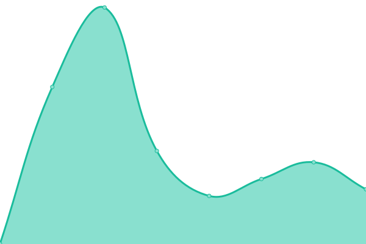

# [📈 Live Status](https://d4khosting.github.io/uptime-crwdp-ca): <!--live status--> **🟩 All systems operational**

This repository contains the open-source uptime monitor and status page for [D4K Hosting](www.d4khosting.ca), powered by [Upptime](https://github.com/upptime/upptime).

With [Upptime](https://upptime.js.org), you can get your own unlimited and free uptime monitor and status page, powered entirely by a GitHub repository. We use [Issues](https://github.com/d4khosting/uptime-crwdp-ca/issues) as incident reports, [Actions](https://github.com/d4khosting/uptime-crwdp-ca/actions) as uptime monitors, and [Pages](https://d4khosting.github.io/uptime-crwdp-ca) for the status page.

<!--start: status pages-->
<!-- This summary is generated by Upptime (https://github.com/upptime/upptime) -->
<!-- Do not edit this manually, your changes will be overwritten -->
<!-- prettier-ignore -->
| URL | Status | History | Response Time | Uptime |
| --- | ------ | ------- | ------------- | ------ |
|  [D4K Hosting Server](https://www.d4khosting.ca) | 🟩 Up | [d4k-hosting-server.yml](https://github.com/d4khosting/uptime-crwdp-ca/commits/HEAD/history/d4k-hosting-server.yml) | 

 309ms
     
 | 

<a href="https://d4khosting.github.io/uptime-crwdp-ca/history/d4k-hosting-server">100.00%</a>
    

|  [CRWDP Website](https://www.crwdp.ca) | 🟩 Up | [crwdp-website.yml](https://github.com/d4khosting/uptime-crwdp-ca/commits/HEAD/history/crwdp-website.yml) | 

 346ms
     
 | 

<a href="https://d4khosting.github.io/uptime-crwdp-ca/history/crwdp-website">100.00%</a>
    

<!--end: status pages-->

[**Visit our status website →**](https://d4khosting.github.io/uptime-crwdp-ca)

## 📄 License

- Powered by: [Upptime](https://github.com/upptime/upptime)
- Code: [MIT](./LICENSE) © [D4K Hosting](www.d4khosting.ca)
- Data in the `./history` directory: [Open Database License](https://opendatacommons.org/licenses/odbl/1-0/)
